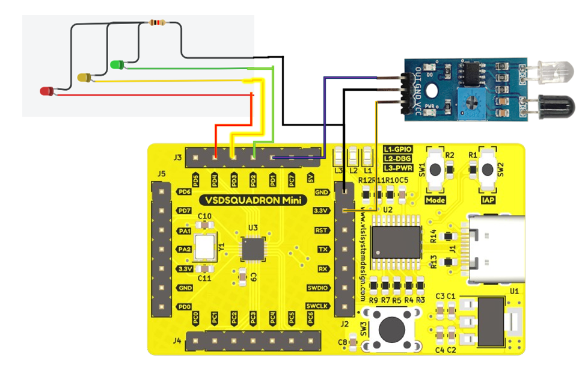

# Obstacle Detecting Using the Infrared(IR) Sensor in VSDSquadron Mini

## Introduction

IR sensors are utilized to detect objects and obstacles. These electronic devices sense specific characteristics of their environment by emitting and/or detecting infrared radiation. 
They can also measure the heat emitted by objects and detect motion. Key applications of IR sensors include:
- Night Vision Devices
- Line Follower Arrays
- Motion Detectors

## Overview
IR light is emitted from the IR emitter, which falls on the object and then reflects back. 
This reflected IR light is captured using an IR receiver and used to conclude the presence of the object. 
If the object is in the vicinity of the IR module, then the object’s presence can be detected. Otherwise, the object is said to be absent.

### IR module
The IR sensor module consists mainly of the IR Transmitter and Receiver. 
IR LED emits light, in the range of Infrared frequency. 
IR light is invisible to us as its wavelength (700nm – 1mm) is much higher than the visible light range. 
- VCC: to +5V or 3.3V. 
- GND: to the ground of the power supply 
- OUT: to any digital pin 

## Components 
1. VSD Squadron Mini board with CH32V003F4U6 chip with 32-bit RISC-V core based on RV32EC instruction set
2. IR Module
3. Leds - Red, Yellow, Green
4. Resistors - 220 ohms

## Circuit Connection Diagram

